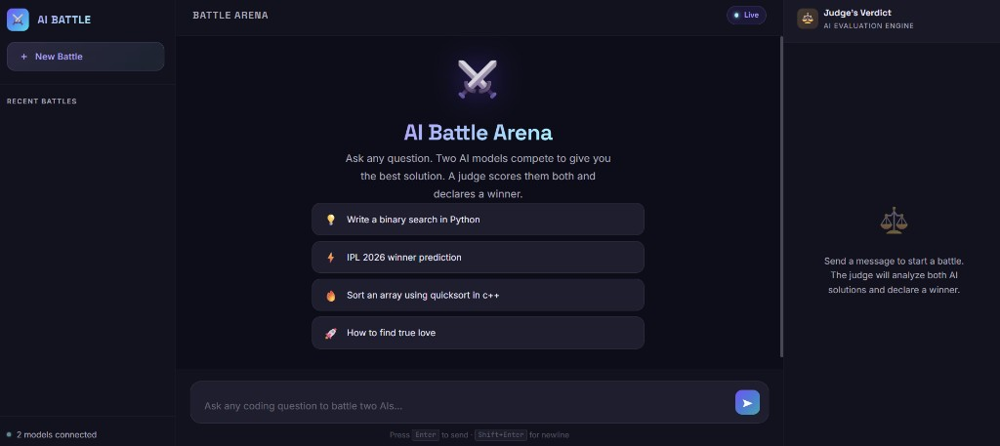
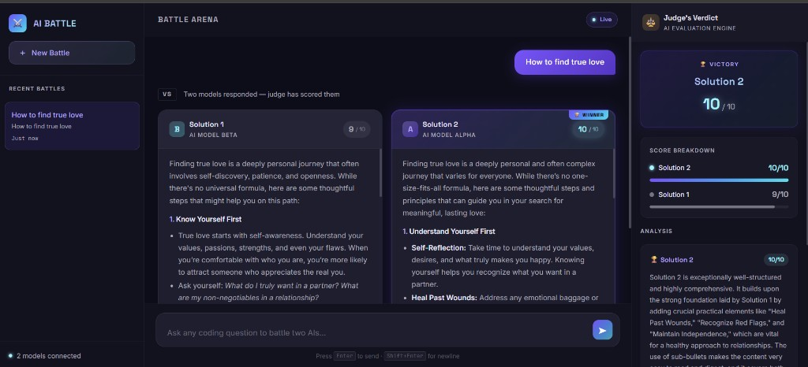
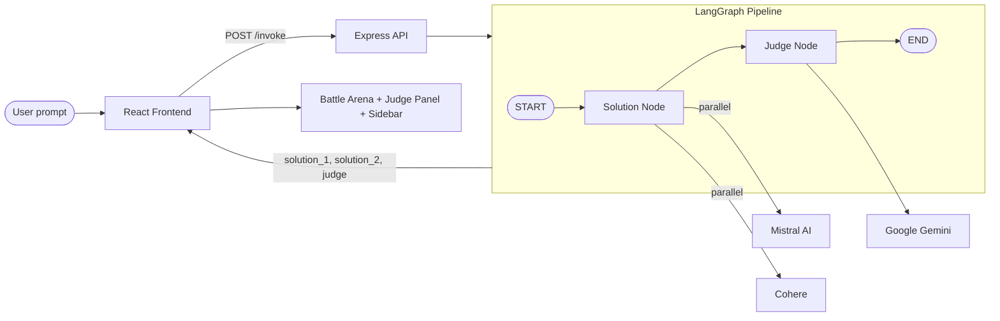

# AI Battle Arena

**AI Battle** is a full-stack web app where you ask any question and two AI models compete side-by-side to produce the best answer. A third AI judge scores both responses, declares a winner, and explains its reasoning.





---

## Table of Contents

- [Features](#features)
- [How It Works](#how-it-works)
- [Tech Stack](#tech-stack)
- [Project Structure](#project-structure)
- [Getting Started](#getting-started)
- [Environment Variables](#environment-variables)
- [API Reference](#api-reference)
- [Frontend Overview](#frontend-overview)
- [Backend Overview](#backend-overview)
- [Sidebar & Chat History](#sidebar--chat-history)

---

## Features

- **Dual-model battle** — Mistral and Cohere generate two independent solutions in parallel for every prompt.
- **AI judge** — Google Gemini evaluates both answers, assigns scores out of 10, and provides detailed reasoning.
- **Side-by-side comparison** — Solution cards display markdown, syntax-highlighted code blocks, and winner badges.
- **Judge panel** — Score breakdown bars, victory announcement, and per-solution analysis.
- **Battle history sidebar** — Recent battles update automatically with id, title, preview, and timestamp when you send a prompt.
- **Welcome screen** — Suggestion chips for quick-start prompts.
- **Dark theme UI** — Three-column layout: sidebar, battle arena, and judge panel.

---

## How It Works



1. The user types a prompt in the chat input (or clicks a suggestion chip).
2. The frontend sends the prompt to `POST /invoke` on the backend.
3. The **Solution Node** calls Mistral and Cohere in parallel to generate `solution_1` and `solution_2`.
4. The **Judge Node** sends both solutions to Gemini, which returns structured scores and reasoning.
5. The frontend renders both solution cards, highlights the winner, and updates the judge panel and sidebar.

---

## Tech Stack

| Layer | Technologies |
|-------|-------------|
| **Frontend** | React 19, Vite 7, Axios, React Markdown, React Syntax Highlighter, Tailwind CSS 4 |
| **Backend** | Node.js, Express 5, TypeScript, LangChain, LangGraph |
| **AI Models** | Mistral (`mistral-medium-latest`), Cohere (`command-a-03-2025`), Google Gemini (`gemini-2.5-flash`) |

---

## Project Structure

```
AI-BATTLE/
├── Backend/
│   ├── server.ts                 # Entry point — starts Express on port 3000
│   └── src/
│       ├── app.ts                # Express routes (/ and /invoke)
│       ├── config/
│       │   └── config.ts         # Loads API keys from .env
│       └── ai/
│           ├── model.ai.ts       # Mistral, Cohere, Gemini model instances
│           └── graph.ai.ts       # LangGraph pipeline (solution → judge)
│
├── Frontend/
│   ├── index.html
│   └── src/
│       ├── App.jsx               # Main layout and message state
│       ├── App.css / index.css   # Styling
│       ├── components/
│       │   ├── Sidebar.jsx       # Battle history (id, title, preview, time)
│       │   ├── ChatInput.jsx     # Prompt textarea with send button
│       │   ├── SolutionCard.jsx  # Markdown + code rendering per model
│       │   ├── JudgePanel.jsx    # Scores, winner, and reasoning
│       │   └── LoadingSkeleton.jsx
│       └── services/
│           └── api.js            # Axios client for /invoke
│
├── docs/
│   └── screenshots/              # App screenshots for documentation
│       ├── welcome-screen.png
│       └── battle-result.png
│
└── README.md
```

---

## Getting Started

### Prerequisites

- Node.js 18+
- API keys for [Mistral AI](https://mistral.ai/), [Cohere](https://cohere.com/), and [Google AI (Gemini)](https://ai.google.dev/)

### 1. Clone the repository

```bash
git clone <repository-url>
cd AI-BATTLE
```

### 2. Backend setup

```bash
cd Backend
npm install
```

Create a `.env` file in the `Backend/` folder (see [Environment Variables](#environment-variables)).

```bash
npm run dev
```

The backend runs at `http://localhost:3000`.

### 3. Frontend setup

Open a second terminal:

```bash
cd Frontend
npm install
```

Create a `.env` file in the `Frontend/` folder (optional — defaults to `http://localhost:3000`):

```env
VITE_BACKEND_URL=http://localhost:3000
```

```bash
npm run dev
```

The frontend runs at `http://localhost:5173` (default Vite port).

### 4. Start a battle

Open the app in your browser, type a question (or pick a suggestion), and press **Enter**. Two AI models will respond and the judge will score them.

---

## Environment Variables

### Backend (`Backend/.env`)

| Variable | Description |
|----------|-------------|
| `GOOGLE_API_KEY` | Google Gemini API key (used by the judge) |
| `MISTRAL_API_KEY` | Mistral AI API key (Solution 1) |
| `COHERE_API_KEY` | Cohere API key (Solution 2) |
| `PORT` | Optional — server port (default: `3000`) |

### Frontend (`Frontend/.env`)

| Variable | Description |
|----------|-------------|
| `VITE_BACKEND_URL` | Backend base URL (default: `http://localhost:3000`) |

---

## API Reference

### `GET /`

Health check.

**Response:**
```json
{ "status": "ok" }
```

### `POST /invoke`

Runs the AI battle pipeline for a given prompt.

**Request body:**
```json
{
  "input": "Write a binary search in Python"
}
```

**Success response (`200`):**
```json
{
  "message": "graph executed successfully",
  "success": true,
  "result": {
    "problem": "Write a binary search in Python",
    "solution_1": "...",
    "solution_2": "...",
    "judge": {
      "solution_1_score": 8,
      "solution_2_score": 9,
      "solution_1_reasoning": "...",
      "solution_2_reasoning": "..."
    }
  }
}
```

**Error response (`400` / `500`):**
```json
{
  "message": "Failed to execute graph",
  "success": false,
  "error": "Error description"
}
```

---

## Frontend Overview

The UI is a three-column layout:

| Column | Component | Purpose |
|--------|-----------|---------|
| Left | `Sidebar` | Brand, **New Battle** button, recent battle history |
| Center | `App` + `ChatInput` | Welcome screen or chat messages, solution cards, input |
| Right | `JudgePanel` | Winner, score bars, and judge analysis |

### Key components

- **`ChatInput`** — Auto-resizing textarea; **Enter** sends, **Shift+Enter** adds a newline.
- **`SolutionCard`** — Renders markdown with GFM support and syntax-highlighted code blocks with copy buttons.
- **`JudgePanel`** — Shows empty state until a battle completes, then displays winner, scores, and reasoning.
- **`LoadingSkeleton`** — Shown while waiting for the AI pipeline to finish.

### Message flow in `App.jsx`

- `handleSend(prompt)` — Updates sidebar history, adds the user message, calls the API, and renders battle results.
- `handleNewChat()` — Clears messages and resets the active battle.
- `handleSelectChat(id)` — Selects a battle from the sidebar (history selection).

---

## Backend Overview

### AI models (`model.ai.ts`)

| Export | Provider | Model | Role |
|--------|----------|-------|------|
| `mistralAIModel` | Mistral AI | `mistral-medium-latest` | Solution 1 |
| `cohereModel` | Cohere | `command-a-03-2025` | Solution 2 |
| `geminiModel` | Google | `gemini-2.5-flash` | Judge |

### LangGraph pipeline (`graph.ai.ts`)

**State schema:**
- `problem` — User prompt
- `solution_1` — Mistral response
- `solution_2` — Cohere response
- `judge` — Scores (0–10) and reasoning for each solution

**Nodes:**
1. **solution** — Invokes Mistral and Cohere in parallel via `Promise.all`.
2. **judge_node** — Uses Gemini with structured output (Zod schema) to score and explain both solutions.

**Graph edges:** `START → solution → judge_node → END`

---

## Sidebar & Chat History

When you send a prompt from the chat input, the sidebar **Recent Battles** list updates automatically:

| Field | Behavior |
|-------|----------|
| **id** | Unique timestamp-based ID for each new battle |
| **title** | First 40 characters of the prompt (truncated with `…` if longer) |
| **preview** | Full prompt text |
| **time** | Set to `"Just now"` on create or update |

- **New battle** — Click **New Battle**, then send a prompt → a new sidebar entry is created and selected.
- **Same battle** — Sending another prompt in the active session updates that entry’s preview and time.
- Helper functions `createChatEntry()` and `updateChatEntry()` live in `Sidebar.jsx` and are used by `App.jsx`.

---

## Scripts

### Backend

| Command | Description |
|---------|-------------|
| `npm run dev` | Start dev server with hot reload (`tsx watch`) |

### Frontend

| Command | Description |
|---------|-------------|
| `npm run dev` | Start Vite dev server |
| `npm run build` | Production build |
| `npm run preview` | Preview production build |
| `npm run lint` | Run ESLint |

---

## License

ISC
